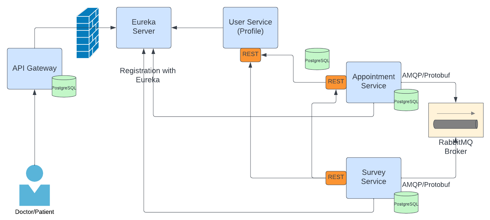

## This project was part of a technical interview done in a limited time.

### Requirements
- Communication with the system is possible only for authenticated users
- Display of free appointments and providers (specialist doctors) for the selected health service
- If the user authenticates as a doctor, he can add list of free appointments
- Free appointments are not tied to specific services, but the patient can make an appointment with any doctor
  service in any free time.
- The patient can book an appointment with the doctor. This appointment can then also be cancelled, thus becoming again
  available to other patients.
- After the appointment, the system generates a satisfaction survey. Basic data about the survey (data about
  doctor, appointment, service) is returned by the server at some URL.
- The surveys are then processed and verifies asynchronously, the aggregated data is stored in the appropriate table in the database.
- Solution should be microservice oriented

## My Solution
### Tehnology Stack
- Spring Boot / Spring Boot Cloud
- PostgreSQL
- RabbitMQ
- Gradle
- Docker

## HLA Architecture


## Project Structure
- **config** - configuration-related classes
- **client** - if microservice talks to some other microservices, classes will be placed here
- **domain** - related to database, like entities
- **repository** - data access layer
- **service** - business logic
- **security** - security-related classes, only in API Gateway
- **util** - utility static methods
- **web** direct expose to the clients via rest
  - **controller** - controllers
  - **dto** - data transfer objects
  - **exception** - exceptions

## Security
Authentication is done using Basic authentication where user provides credentials and exchange them for JWT token.

Subsequent requests are authorized using JWT token. API Gateway is responsible for authenticating and authorizing
clients, before sending the requests downstream to the microservices.

Currently, to roles exists: PATIENT and DOCTOR and routes are defined appropriately depending on the role of the user logged in.

Role and UserID are kept in the JWT token.

Passwords (defaults: password) are encoded and saved to db as bcrypt using 12 rounds.
For simplicity, I am storing salt together with the password digest in the same field.

## IPC (between microservices)
REST
Rest is used for direct communication between the microservices using Feign clients.

AMQP
Amqp protocol is used for sending events when necessary, for example when appointment is submitted as done by the doctor.
Consumers such as Survey, listens to the events related to appointment's status change, and react by generating URL with informations
about the appointment, and can be accessed from the clients that wants to fill out and submit the survey.
Broker that I used is RabbitMQ.

## Setting up
There a just a few steps one needs to take to setup the project:
Requirements:
- Docker
- Docker Compose

Starting docker:
```
docker compose up -d
```
Before starting the microservices, Eureka should be up.
To start the services, go into each of the module directories, starting with eureka-server, and run:
```
./gradlew bootRun
```

## Database
Entities:
#### API Gateway Service:
- **User** - this will only keep basic user data like email, username, and password
#### Profile/User Service:
- **DoctorProfile** - specific profile for doctors
- **PatientProfile** - specific profile for patients
- **MedicalService** - this will keep list of medical services provided. It is a many-to-many relationship with the doctors
#### Appointment Service:
- **Appointment** - will hold all appointment data
- **Timeslot** - every date and time are kept in this table. Timeslots are owned by Timetable
- **Timetable** - this table has list of timeslots. It is in one-to-one relationship with the doctor
#### Survey Service:
- **Survey** - survey as submitted by the patient
- **AggregatedSurvey** - aggregated data for the surveys for every doctor

## Usage
There is a **requests.http** file that lists every requests that system can receive.
Also, there is a **http-client.env.json** file, that keeps environment variables used in the **requests.http**.
File can be read by IDEA Ultimate or some other client plugin.
When /auth endpoint is called, variable is automatically updated with the new value received in the response body.

## Endpoints:
POST /api/auth - user authorization
<br>Request example:
```json
{
  "username": "patient1",
  "password": "password"
}
```

POST /api/timetable - for doctors to add timeslots
<br>Request example:
```json
[
  {
    "date": "10.08.2022",
    "time": "06:45"
  },
  {
    "date": "13.08.2022",
    "time": "07:15"
  }
]
```

GET /api/timeslots?medicalService={id} - obtain all free timeslots for specific service

POST /api/appointments - patients can reserve an appointment
<br>Request example:
```json
{
  "doctorId": 1,
  "medicalServiceId": 3,
    "timeslot": {
      "date": "13.08.2022",
      "time": "07:15"
    }
}
```

DELETE /api/appointments/{appointmentId}/cancel - cancel reserved appointment

PATCH /api/appointments/{appointmentId} - doctor can change status of the appointment
<br>Request example:
```json
{
  "appointmentStatus": "DONE"
}
```

GET /api/survey?doctorId={doctorId}&timeslot={timeslot}&medicalServiceId={medicalServiceId} - allows frontend to call this to get survey data for which user needs to submit the survey

POST /api/survey/submit
<br>Request example:
```json
{
  "doctorId": 1,
  "patientId": 3,
  "caseId": "daeb4fax",
  "caseDateTime": "2022-08-13 07:15:00",
  "satisfaction": 1
}
```